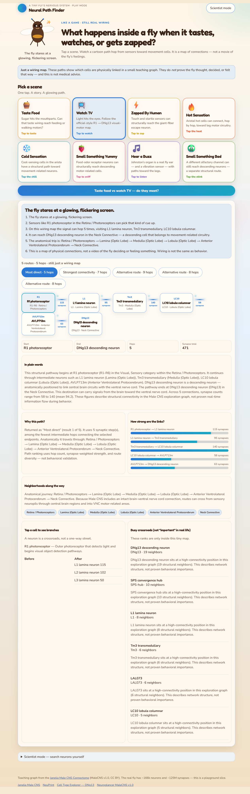
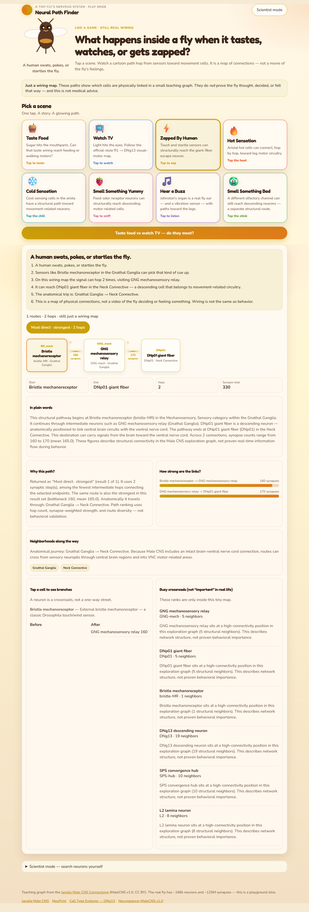
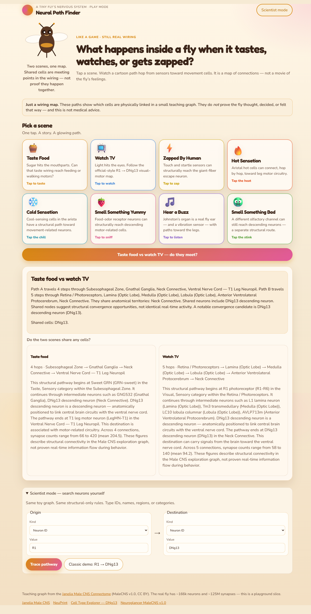
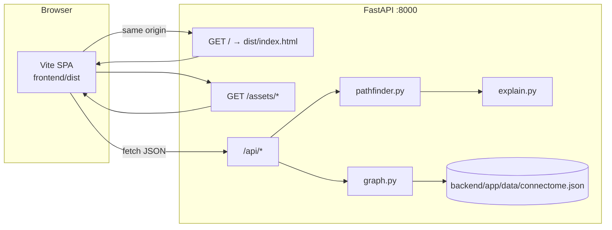
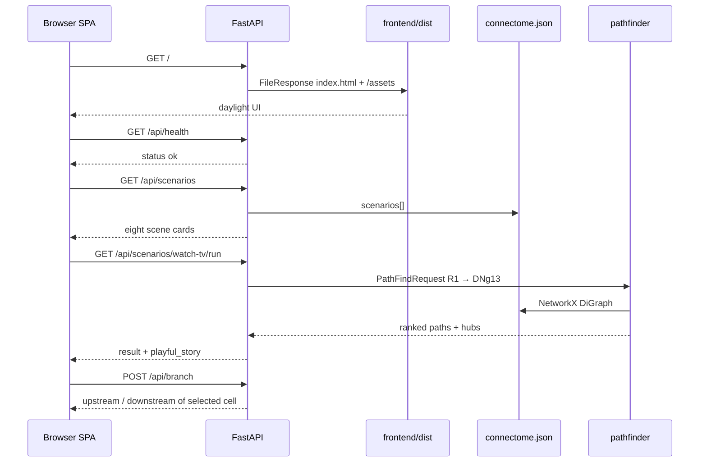

# Neural Path Finder

**Google Maps for a fruit fly’s wiring.** Tap a moment in the fly’s day — tasting food, watching a flickering screen, getting zapped — and watch a cartoon path hop from sensors toward movement cells.

This is a playful exhibit over a **curated teaching graph** of the [HHMI Janelia FlyEM Male CNS Connectome](https://www.janelia.org/project-team/flyem/male-cns-connectome) (MaleCNS v1.0, CC BY). The real fly has about **166,000 neurons** and **125 million synapses**. This app does not load that volume. It traces **structural** connections on a compact, named subgraph so a browser can keep up.

> It is a map of connections — not a movie of the fly’s feelings. Paths do not prove the fly thought, decided, or felt that way, and this is not medical advice.

## Play a fly’s day

A warm daylight UI, a cartoon mascot, and eight scenes. One tap runs a real pathfinder on the teaching graph and tells a short story.


*Landing: pick a scene. The fly waits in the sunshine.*

### 1. Choose a scene

Taste Food, Watch TV, Zapped By Human, Hot, Cold, Smell Something Yummy, Hear a Buzz, Smell Something Bad. Each card is a preferred start and end cell in the same connectome JSON the API loads.


*The Watch TV card is selected — that scene traces photoreceptor **R1** toward descending neuron **DNg13**.*

### 2. Follow the wires

The result is a hop strip: neurons as stations, synapse counts as the tracks between them. Tabs offer most-direct vs strongest vs alternative walks. Tap a cell to see upstream and downstream neighbors.



*A Watch TV run: story beats, ranked routes, and the anatomical walk from retina toward descending motor cells.*


*The connectome view in the UI: a directed path drawn as cards and glowing edges (not a 3D volume).*

### 3. Zap the fly

Mechanosensory bristle cells toward giant-fiber-class **DNp01**. Same engine, different mood.



*Zapped By Human: a short structural escape-style walk, still labeled as a wiring map.*

### 4. Do two scenes meet?

Taste food vs watch TV asks whether the top routes share any cells. Shared nodes are meeting points in the graph, not proof the behaviors happen together.



*Compare: two `POST /api/paths/compare` queries, one split panel.*

### 5. Scientist mode

Search by neuron ID, name, cell type, region, or category. Classic demo: **R1 → DNg13**.


*Same toy graph, same structural-only rules — you pick the endpoints.*

## How to run

Python 3.12+ and Node.js 20+. The virtual environment **must be named `fly`**.

```powershell
python -m venv fly
.\fly\Scripts\Activate.ps1
pip install -r requirements.txt
python scripts/generate_connectome.py
cd frontend; npm install; npm run build; cd ..
$env:PYTHONPATH = "backend"
.\fly\Scripts\python.exe backend\run.py
```

macOS / Linux:

```
python3 -m venv fly
source fly/bin/activate
pip install -r requirements.txt
python scripts/generate_connectome.py
cd frontend && npm install && npm run build && cd ..
PYTHONPATH=backend python backend/run.py
```

Open [http://127.0.0.1:8000](http://127.0.0.1:8000). FastAPI serves the built `frontend/dist` SPA and `/api` from the same origin. After UI/theme edits, rebuild the frontend (`cd frontend; npm run build`) so `dist` updates.

Health check: `GET /api/health` → `{ "status": "ok", "product": "Neural Path Finder" }`.

### Frontend development

With the API already on port 8000:

```
cd frontend
npm install
npm run dev
```

Vite (port 5173) proxies `/api` to `http://127.0.0.1:8000`.

### Tests

```
$env:PYTHONPATH = "backend"
.\fly\Scripts\python.exe -m pytest backend\tests -q
```

## How it works

The browser never talks to Janelia at runtime. A hand-authored `connectome.json` is loaded once, turned into a NetworkX directed graph, and queried over HTTP.



Boot and a tap-to-play run:



More diagrams, ranking rules, and the live 75-neuron / 149-edge stats: **[docs/ARCHITECTURE.md](docs/ARCHITECTURE.md)**.

## API (same origin `/api`)

| Method | Path | Purpose |
| --- | --- | --- |
| GET | `/api/health` | Liveness |
| GET | `/api/meta` | Dataset metadata, categories, regions |
| GET | `/api/neurons?q=` | Search neurons |
| GET | `/api/neurons/{id}/neighbors` | Upstream / downstream |
| POST | `/api/branch` | Branching view |
| POST | `/api/paths/find` | Multiple structural paths |
| POST | `/api/paths/compare` | Compare two queries |
| GET | `/api/journeys` | Guided journeys |
| GET | `/api/scenarios` | Playful tap-to-play scenes |
| GET | `/api/scenarios/{id}/run` | Run a scene and return story + paths |
| GET | `/api/hubs` | Structural hubs |

Example body for `POST /api/paths/find`:

```json
{
  "source": { "kind": "neuron", "value": "R1" },
  "destination": { "kind": "neuron", "value": "DNg13" }
}
```

`kind` may be `neuron`, `name`, `type`, `region`, or `category`. Interactive OpenAPI: [http://127.0.0.1:8000/docs](http://127.0.0.1:8000/docs).

## Project layout

```
backend/app/           FastAPI app, pathfinder, graph loader
backend/app/data/      Generated connectome.json
backend/run.py         Uvicorn entrypoint (0.0.0.0:8000)
backend/tests/         pytest coverage for health, journeys, paths, compare, neighbors
frontend/              Vite + vanilla HTML/CSS/JS exhibit UI
docs/screenshots/      Walkthrough captures of the running app
docs/ARCHITECTURE.md   Data, algorithms, API map, Mermaid diagrams
scripts/generate_connectome.py
```

## Disclaimer

Connectivity here is **structural** (synaptic anatomy). A structural path does **not** prove causal activity flow during real behavior, does not establish that these cells fire together, and supports **no medical conclusions**. Ranked “hubs” describe network structure in this 75-node graph, not proven behavioral importance.

## Dataset

- Organism: *Drosophila melanogaster* (adult male)
- Source: [Janelia Male CNS Connectome](https://www.janelia.org/project-team/flyem/male-cns-connectome)
- [NeuPrint](https://neuprint.janelia.org/) · [Cell Type Explorer — DNg13](https://reiserlab.github.io/celltype-explorer-drosophila-male-cns/types/DNg13.html) · [Neuroglancer MaleCNS v1.0](https://neuroglancer-demo.appspot.com/#!gs://flyem-male-cns/v1.0/male-cns-v1.0.jso)
- License: CC BY

Application code in this repository is provided for research and education. Underlying connectome data remain under Janelia’s CC BY terms.
