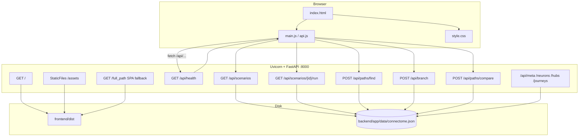
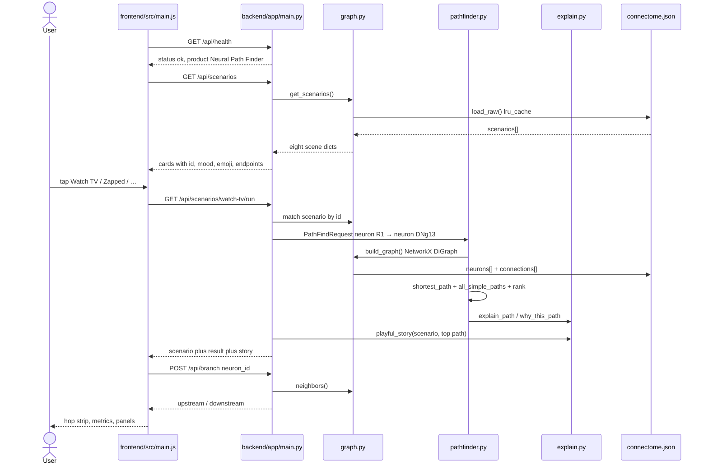
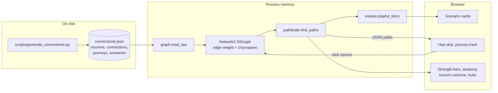
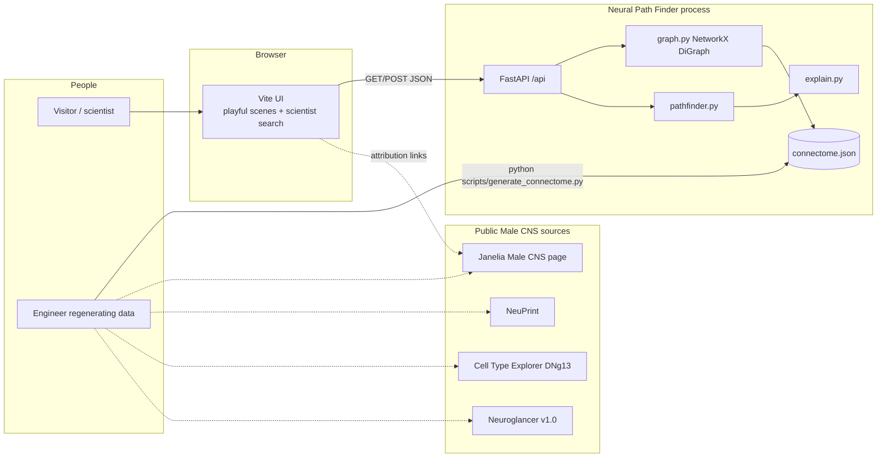
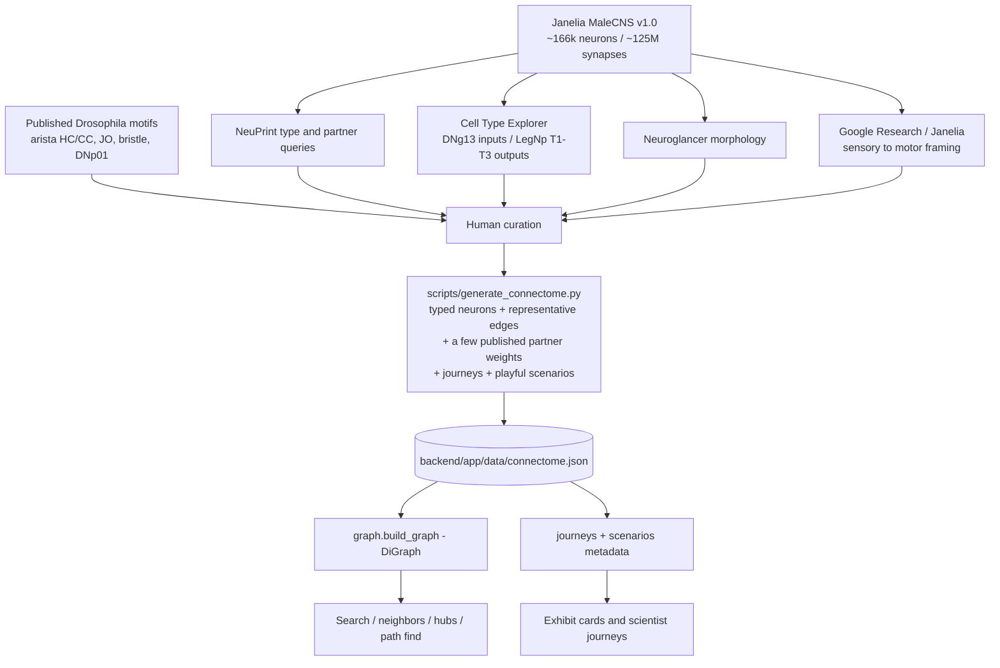
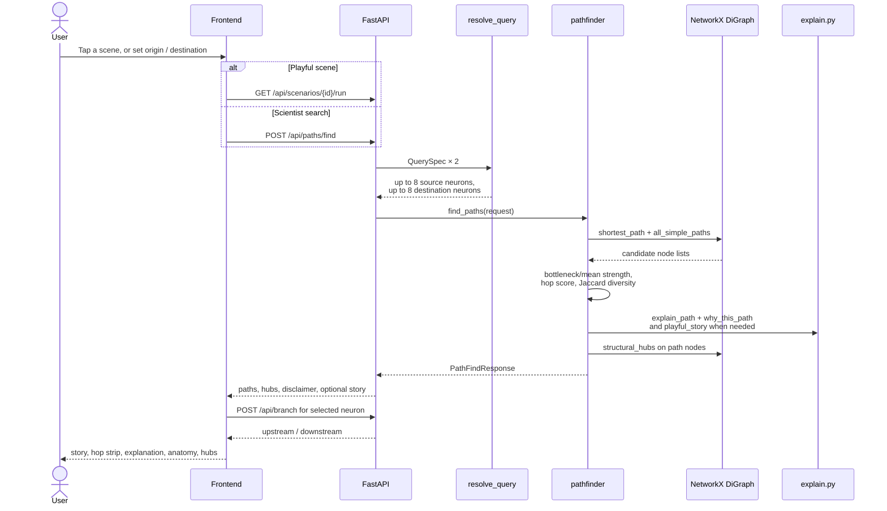
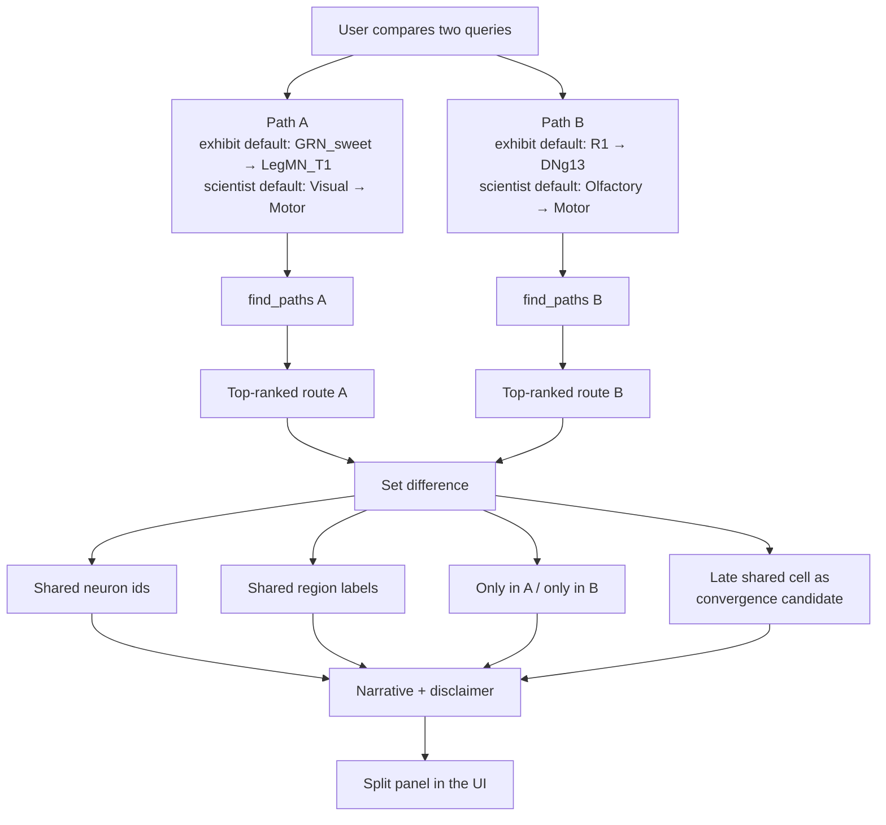
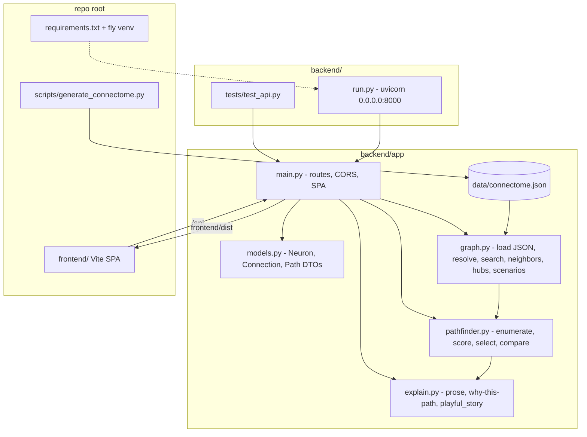

# Neural Path Finder — Architecture

This document explains **what data Neural Path Finder uses**, **how that data was explored and curated**, and **how the program is built**. It is written for two audiences at once: a general reader who wants the map, and an engineer who needs the modules, APIs, and ranking rules.

Neural Path Finder is a browser app that treats a small piece of a fruit-fly nervous system like a transit map. The home screen is a **tap-to-play exhibit** (taste food, watch a flickering screen, get startled, feel hot or cold, …). Scientist mode still lets you pick an origin and a destination — a photoreceptor, a smell cell, a motor neuron — and inspect structural routes: hops, synapse counts, anatomy, alternatives, and nearby hubs.

**What it is not:** a dump of the full Male CNS volume, a simulator of spikes, or a claim that these cells fire together during behavior.

The live graph is loaded from [`backend/app/data/connectome.json`](../backend/app/data/connectome.json). Counts in this document were computed from that file (and from NetworkX on the same graph). They are not estimates.

---

## 1. Data that has been used

### 1.1 The published connectome

| Field | Value |
| --- | --- |
| Dataset | HHMI Janelia FlyEM **Male CNS Connectome** |
| Version | **MaleCNS v1.0** |
| Released | **2026-06-08** |
| License | **CC BY** |
| Animal | Adult male *Drosophila melanogaster* |
| Full published scale | about **166,000 neurons** and **125 million synapses** |

Male CNS is unusual among fly connectomes because the brain and the ventral nerve cord (VNC) stay attached. That intact neck connective is why a question like “how can an eye cell reach a leg motor neuron?” is even well-posed.

This app **does not load** the 166k / 125M volume. It uses a **curated exploration subgraph**: typed neurons and representative directed edges so a laptop browser can path-find in well under a second.

| Scope | Neurons | Directed edges |
| --- | --- | --- |
| Full MaleCNS v1.0 (published) | ~166,000 | ~125,000,000 synapses (many-to-many) |
| This app’s live graph (`connectome.json`) | **75** | **149** |

### 1.2 Authoritative sources

These are the public places the graph is grounded in. They are also the places a reader should go to explore the *real* volume.

| Source | Why it matters |
| --- | --- |
| [Janelia Male CNS Connectome](https://www.janelia.org/project-team/flyem/male-cns-connectome) | Project page: release, scale, license, scientific framing. |
| [male-cns.janelia.org](https://male-cns.janelia.org/) | Dataset home. |
| [NeuPrint](https://neuprint.janelia.org/) | Query neurons, types, synapses, and partners on the full reconstruction. |
| [Male CNS Cell Type Explorer — DNg13](https://reiserlab.github.io/celltype-explorer-drosophila-male-cns/types/DNg13.html) | Official cell-type page used as the motif and partner list for the visual–motor example. |
| [Neuroglancer MaleCNS v1.0](https://neuroglancer-demo.appspot.com/#!gs://flyem-male-cns/v1.0/male-cns-v1.0.jso) | 3D morphology and neuropil context. |
| Google Research / Janelia public framing | Sensory neurons can be traced, hop by hop, toward descending and motor cells — “maps” of possible anatomical influence, not proven causal flow. |

The official **reference motif** this product is built around is:

**R1–R6 photoreceptors → optic lobe → central brain partners → DNg13 → VNC leg neuropils (LegNp T1 / T2 / T3).**

Janelia highlights DNg13 as a visual–motor descending neuron. The Cell Type Explorer lists strong upstream partner *types* (for example VES200m, LAL073, CB0244, GNG532, MBON35) and strong output into **LegNp(T1)**. Several synapse numbers in our graph repeat those published partner-scale strengths. The rest of the edges are **representative** so ranking still has contrast at toy-graph scale.

Thermosensory and mechanosensory cells in this graph are grounded in well-known *Drosophila* motifs (aristal hot/cold cells and posterior antennal lobe; bristle mechanoreceptors, class IV md nociceptors, femoral chordotonal organ, giant-fiber-class DNp01). They are **teaching annotations**, not a NeuPrint dump of those types from MaleCNS v1.0.

### 1.3 Fields we keep

Every neuron in `connectome.json` has:

| Field | Meaning in this app |
| --- | --- |
| `id` | Stable node key used by the pathfinder (`R1`, `DNg13`, `ORN_DM1`, `HC_arista`, …). |
| `name` | Human label shown in the UI. |
| `cell_type` | Male CNS / Drosophila type string (`R1-R6`, `DNg13`, `ORN-DM1`, `HC-arista`, …). This is the “type” field. |
| `region` | Short region code (`retina`, `lamina`, `arista`, `vnc_t1`, …). |
| `region_label` | Long name used in the anatomical stepper. |
| `side` | Body side. In the live JSON every neuron is `"right"`. |
| `categories` | Search, journey, and scene tags. A neuron may have more than one. |
| `role` | `sensory`, `interneuron`, `descending`, or `motor`. Used to pick endpoints on category queries. |
| `neurotransmitter` | Optional (`Histamine`, `ACh`, `Glu`, `GABA`, or omitted). |
| `description` | One-sentence annotation for tooltips and explanations. |
| `source` | Provenance string: MaleCNS v1.0 curated exploration graph (Janelia FlyEM). |

Every connection has:

| Field | Meaning |
| --- | --- |
| `source` | Presynaptic neuron `id`. |
| `target` | Postsynaptic neuron `id`. |
| `synapses` | Integer weight. Mix of published partner strengths and representative weights. |
| `note` | Optional citation-style comment (only four live edges have notes). |
| `claim_level` | Always **`structural_connectivity`**. Anatomy only — never causal, functional, or medical. |

Pydantic models live in [`backend/app/models.py`](../backend/app/models.py). The graph loader validates these fields and builds a NetworkX `DiGraph`.

### 1.4 Sensory and motor categories actually in the repo

**Live JSON category list** (`connectome.json` → `categories`):

`Visual`, `Olfactory`, `Auditory`, `Taste`, `Motor`, `Descending`, `Sensory`, `Central`, `Temperature`, `Hot`, `Cold`, `Mechanosensory`, `Nociception`.

Neuron-tag counts (a neuron can appear in more than one category):

| Category | Neurons | What it covers here |
| --- | --- | --- |
| Visual | 24 | R1–R6, lamina L1–L3, medulla/lobula cells, AOTU, some AVLP/PVLP/WED relays. |
| Central | 21 | LAL / Vest / GNG / SPS and other brain intermediates, including several DNg13 partners and thermo/mechano relays. |
| Sensory | 18 | All primary receptors: visual, olfactory, auditory, taste, hot, cold, touch/nociception, FeCO. |
| Olfactory | 10 | ORNs, uniglomerular PNs, Kenyon cells, MBON35, LH, SMP471. |
| Motor | 9 | Four descending cells plus T1–T3 leg motors, IN19A015, and `MN_proboscis`. |
| Mechanosensory | 8 | Johnston’s organ (also Auditory), bristle MR, mdIV, FeCO, GNG/AMMC mech relays, DNp01. |
| Auditory | 6 | Johnston’s organ JO-A/B, AMMC relays, WED/AVLP auditory relays. |
| Taste | 6 | Sweet/bitter GRNs, SEZ interneurons, GNG taste relay, proboscis MN. |
| Temperature | 6 | Aristal HC/CC, PAL hot/cold relays, thermosensory PNs. |
| Descending | 4 | DNg13, DNp56, DNg97, DNp01 (giant-fiber class). |
| Hot | 3 | `HC_arista`, `PAL_hot`, `TPN_hot`. |
| Cold | 3 | `CC_arista`, `PAL_cold`, `TPN_cold`. |
| Nociception | 1 | `mdIV` (class IV md). |

Roles in the live file: **49 interneuron**, **18 sensory**, **4 descending**, **4 motor**.

Neurotransmitters present: Histamine (6, the R1–R6 cells), ACh (21), Glu (3), GABA (2), omitted (43).

### 1.5 Regions in the live graph

The JSON ships **26 region codes**. Occupied counts:

| Code | Label | Live neurons |
| --- | --- | --- |
| `retina` | Retina / Photoreceptors | 6 |
| `al` | Antennal Lobe | 6 |
| `lobula` | Lobula (Optic Lobe) | 5 |
| `ammc` | Antennal Mechanosensory and Motor Center | 5 |
| `sez` | Subesophageal Zone | 5 |
| `medulla` | Medulla (Optic Lobe) | 4 |
| `gng` | Gnathal Ganglia | 4 |
| `neck` | Neck Connective | 4 |
| `pal` | Posterior Antennal Lobe | 4 |
| `lamina` | Lamina (Optic Lobe) | 3 |
| `aotu` | Anterior Optic Tubercle | 3 |
| `lal` | Lateral Accessory Lobe | 3 |
| `ves` | Vest | 3 |
| `central_brain` | Central Brain | 3 |
| `avlp` | Anterior Ventrolateral Protocerebrum | 2 |
| `wed` | Wedge | 2 |
| `vnc` | Ventral Nerve Cord | 2 |
| `vnc_t1` | VNC — T1 Leg Neuropil | 2 |
| `mb` | Mushroom Body | 2 |
| `arista` | Antennal Arista (Thermosensors) | 2 |
| `pvlp` | Posterior Ventrolateral Protocerebrum | 1 |
| `lh` | Lateral Horn | 1 |
| `sps` | Superior Posterior Slope | 1 |
| `vnc_t2` | VNC — T2 Leg Neuropil | 1 |
| `vnc_t3` | VNC — T3 Leg Neuropil | 1 |

`lobula_plate` is defined in the region table but has **no neurons** in the live graph.

---

## 2. Data exploration (a little bit)

### 2.1 How someone explores the real Male CNS

A typical scientific walk, using the same sources we used:

1. **Open the DNg13 Cell Type Explorer page.** Read the type summary, then the partner tables: strongest inputs (VES / LAL / CB / GNG / MBON / AOTU families) and strongest outputs (especially **LegNp T1**, then T2/T3).
2. **Confirm morphology in Neuroglancer.** DNg13 is a descending neuron: dendrites in the brain, axon through the neck, terminals in VNC leg neuropils.
3. **Query NeuPrint** for the same type, for example:
   - neurons of type `DNg13`
   - connections where the target type is `DNg13`, ordered by synapse weight
   - innervation of `LegNp(T1)`, `LegNp(T2)`, `LegNp(T3)`
   - upstream types such as `VES200m`, `LAL073`, `AOTU002`
4. **Walk one sensory channel the other way.** Start at `R1-R6` (or an ORN type, a JO neuron, a GRN), list primary partners, then ask which of those partners sit on a path that eventually reaches a descending type.
5. **Keep the Google Research / Janelia framing in mind:** these are **anatomical possibility maps** from sensors toward motors, not circuit diagrams of a recorded behavior.

That is how the official motif was chosen: R1–R6 is a named visual start, DNg13 is a named visual–motor end, and LegNp T1/T2/T3 are named motor territories.

### 2.2 How this repo was curated

[`scripts/generate_connectome.py`](../scripts/generate_connectome.py) is a **hand-authored graph**, not a NeuPrint export.

What we selected:

- **Typed neurons** that a non-specialist can search or tap in a scene: R1–R6, L1–L3, Mi1, Tm3, T4/T5, LC10/LC11, AOTU002/015/016, the published-style DNg13 partner types, four descending cells (including giant-fiber-class DNp01), three leg motor cells, a proboscis motor cell, compact olfactory / auditory / taste / thermo / mechanosensory chains.
- **Representative edges** so every sensory category can reach a descending or motor cell in a handful of hops.
- **A few published-scale weights** copied from the DNg13 explorer (and labeled in `note`) so the “strongest” ranker has real contrast at the motif’s bottleneck.
- **Deterministic filler weights** (`stable_mod` over MD5) for photoreceptor→lamina fan-in, so `PYTHONHASHSEED` cannot reshuffle the demo.
- **Playful scenario records** (`scenarios` in the same JSON) that point at those same cells. The exhibit UI does not invent a second graph.

What we did **not** do:

- ingest the full NeuPrint adjacency
- preserve left/right copies (everything is `side: right`)
- claim that a 149-edge graph is a statistical sample of 125 million synapses

The script writes `backend/app/data/connectome.json`. The API never talks to Janelia at runtime.

### 2.3 Live-graph statistics (computed, not invented)

From `connectome.json` plus NetworkX:

| Statistic | Value |
| --- | --- |
| Neurons | **75** |
| Directed connections | **149** |
| Distinct cell types | 70 |
| Neurons with more than one category | 36 |
| Weakly connected | yes (1 component) |
| Strongly connected | no (75 trivial SCCs — feed-forward-ish in practice) |
| Directed density | 149 / (75 × 74) = **2.68%** |
| Mean degree (in+out) | **3.97** |
| Synapse weight min / median / mean / max | **19 / 70 / 85.7 / 420** |
| Sum of synapse weights | **12,765** |
| Edges with a citation-style `note` | **4** |
| `claim_level` | `structural_connectivity` on **all 149** edges |
| Isolated neurons | **0** |

**Hubs by degree (top 8)**

| id | Name | Degree | In | Out |
| --- | --- | --- | --- | --- |
| DNg13 | DNg13 descending neuron | 19 | 15 | 4 |
| SPS_hub | SPS convergence hub | 10 | 7 | 3 |
| L1 | L1 lamina neuron | 8 | 6 | 2 |
| L2 | L2 lamina neuron | 8 | 6 | 2 |
| WED_aud | WED auditory relay | 8 | 4 | 4 |
| L3 | L3 lamina neuron | 7 | 6 | 1 |
| DNg97 | DNg97 descending neuron | 7 | 6 | 1 |
| IN19A015 | IN19A015 VNC interneuron | 7 | 5 | 2 |

`SPS_hub` rose once thermo and mechanosensory streams were wired through it. DNg13 remains the degree champion because many explorer-style partners still point at it.

**Hubs by unweighted betweenness (top 6)** — this is what `/api/hubs` uses, combined with degree:

| id | Betweenness | Degree |
| --- | --- | --- |
| DNg13 | 0.0395 | 19 |
| Tm3 | 0.0337 | 6 |
| LC10 | 0.0278 | 5 |
| SPS_hub | 0.0249 | 10 |
| AVLP713m | 0.0177 | 5 |
| AOTU015 | 0.0141 | 5 |

**Strongest edges**

| Source | Target | Synapses | Note |
| --- | --- | --- | --- |
| DNg13 | LegMN_T1 | 420 | DNg13 shows strong Male CNS output into LegNp(T1) |
| DNp01 | LegMN_T1 | 310 | representative giant-fiber → front-leg motor |
| DNg13 | LegMN_T2 | 290 | (representative) |
| DNg13 | LegMN_T3 | 250 | (representative) |
| DNp01 | LegMN_T2 | 240 | (representative) |
| ORN_DM1 | PN_DM1 | 210 | (representative first-order olfactory) |
| HC_arista | PAL_hot | 190 | (representative aristal hot-cell synapse) |
| CC_arista | PAL_cold | 185 | (representative aristal cold-cell synapse) |
| VES200m | DNg13 | 181 | Top-ranked upstream partner type for DNg13 in Male CNS explorer |

Weakest live edge: `SPS_hub → DNg13` at **19** synapses.

**Official motif in this graph**

A hop-minimizing R1 → DNg13 route (NetworkX shortest path, 5 hops):

`R1 → L1 → Tm3 → LC10 → AVLP713m → DNg13`

A synapse-weighted variant (edge cost = 1/synapses) is the same length and almost the same cells:

`R1 → L2 → Tm3 → LC10 → AVLP713m → DNg13`

With a hop cutoff of 10, NetworkX enumerates **171** simple R1→DNg13 paths (2 of them at 5 hops; most are 6–8 hops). The API does not return all of them; it ranks a handful (see §3.3).

**Guided scientific journeys** stored in the live JSON:

| id | Title | Preferred endpoints |
| --- | --- | --- |
| `visual-to-movement` | Visual to Movement | `R1` → `LegMN_T1` |
| `visual-to-dng13` | Visual Input to DNg13 | `R1` → `DNg13` |
| `olfactory-to-descending` | Olfactory to Descending Neuron | `ORN_DM1` → `DNg13` |
| `taste-to-motor` | Taste to Motor Circuit | `GRN_sweet` → `LegMN_T1` |
| `auditory-to-motor` | Auditory to Motor | `JO_A` → `LegMN_T2` |
| `hot-to-motor` | Hot Sensation to Motor | `HC_arista` → `LegMN_T2` |
| `cold-to-motor` | Cold Sensation to Motor | `CC_arista` → `LegMN_T2` |
| `touch-to-escape` | Mechanosensory to Escape | `BR_mech` → `DNp01` |

**Playful scenes** stored in the same JSON (`scenarios`, 8 records):

| id | Scene | Endpoints | Category |
| --- | --- | --- | --- |
| `taste-food` | Taste Food | `GRN_sweet` → `LegMN_T1` (via SEZ / GNG relays; `MN_proboscis` remains in the graph) | Taste |
| `watch-tv` | Watch TV | `R1` → `DNg13` | Visual |
| `zapped` | Zapped By Human | `BR_mech` → `DNp01` | Mechanosensory |
| `hot` | Hot Sensation | `HC_arista` → `LegMN_T2` | Hot |
| `cold` | Cold Sensation | `CC_arista` → `LegMN_T2` | Cold |
| `smell-yummy` | Smell Something Yummy | `ORN_DM1` → `DNg13` | Olfactory |
| `hear-buzz` | Hear a Buzz | `JO_A` → `LegMN_T2` | Auditory |
| `smell-bad` | Smell Something Bad | `ORN_DL5` → `DNp56` | Olfactory |

Each scene reuses the same pathfinder. The cartoon fly and story beats are a skin, not a second algorithm.

### 2.4 Honest limitations

- Representative weights are **mixed** with a few published partner strengths. Treat every integer as “useful for ranking this toy graph,” not as a NeuPrint export you can cite as MaleCNS v1.0 connectivity.
- Only four edges carry an explicit explorer note (LAL073→DNg13, VES200m→DNg13, DNg13→LegMN_T1, MBON35→DNg13). Many other DNg13 inputs use explorer-like magnitudes but are unlabeled.
- Thermo / mechanosensory / feeding cells are **motif-grounded teaching nodes**. They make everyday scenes possible; they are not a claim that those exact Male CNS body IDs were imported.
- Left/right copies, unidentified fragments, and the vast majority of cell types are absent.
- Betweenness and “importance” are **local to these 75 nodes**. DNg13 looks like a super-hub because we pointed streams at it.
- A structural path is a chain of synapses, not evidence that information flows that way in a walking fly — and the playful copy is explicit about that.

---

## 3. How the program was built

### 3.1 Environment and stack

The Python virtual environment **must be named `fly`**.

```
python3 -m venv fly
source fly/bin/activate
pip install -r requirements.txt
python scripts/generate_connectome.py
cd frontend && npm install && npm run build
PYTHONPATH=backend fly/bin/uvicorn backend.app.main:app --host 0.0.0.0 --port 8000
```

| Layer | Choice |
| --- | --- |
| API | **FastAPI** (`backend/app/main.py`) + Uvicorn on `0.0.0.0:8000` |
| Graph | **NetworkX** `DiGraph` |
| Data | curated **`connectome.json`** |
| Models | **Pydantic** v2 |
| UI | **Vite** + vanilla HTML / CSS / JS (no React) |
| Tests | pytest in `backend/tests` |

FastAPI serves `/api/*` and, after `npm run build`, the `frontend/dist` SPA from the same origin. Vite’s dev server proxies `/api` to port 8000.

### 3.2 Pipeline

```
Janelia / NeuPrint / Cell Type Explorer / Neuroglancer
        │
        ▼  (human curation of types + a few published weights)
scripts/generate_connectome.py
        │
        ▼
backend/app/data/connectome.json   (neurons, connections, journeys, scenarios)
        │
        ▼
graph.py  →  NetworkX DiGraph
        │
        ├─ pathfinder.py   (shortest / strongest / diverse alts)
        ├─ explain.py      (plain-language, “why this path?”, playful_story)
        └─ main.py         (HTTP)
                │
                ▼
         Vite UI  — tap-to-play scenes + scientist search
```

Runtime path: JSON on disk → `graph.load_raw()` (lru-cached) → `build_graph()` → `find_paths()` → explanation / story strings → JSON response → `frontend/src/main.js`.

### 3.3 Algorithms

All of this is in [`backend/app/pathfinder.py`](../backend/app/pathfinder.py) and [`backend/app/graph.py`](../backend/app/graph.py).

**Resolve the query.** `kind` is `neuron` | `name` | `type` | `region` | `category`. Category searches prefer `role=sensory` as sources and `role=motor` (then `descending`) as destinations, then cap each side at 8 cells so the UI stays interactive.

**Enumerate simple paths.** For each source/target pair:

1. Take NetworkX `shortest_path` first (hop count, unweighted).
2. Then `all_simple_paths` with `cutoff=max_depth` (default 10), capped at 40 candidates.

**Score each path.**

- `score_direct = 1 / hop_count` — fewer hops win (“most direct”).
- `score_strength = 0.6 × min(synapses) + 0.4 × mean(synapses)` — a bottleneck-aware “strongest” score. A single weak hop hurts more than a flashy average.
- Each hop also gets a **strength profile** band: strong / moderate / weak relative to the strongest hop on that same path.

Edge weights stored on the DiGraph are `weight = 1 / synapses` (used if a weighted shortest path is wanted). The ranker itself uses the bottleneck/mean formula above, not Dijkstra.

**Pick a diverse result set** (`_select_diverse_paths`):

1. Label the hop-minimizing candidate **Most direct**.
2. Label the best remaining strength candidate **Strongest connectivity**. If they are the same unique path, the label becomes **Most direct · strongest**.
3. Fill remaining slots (default `max_paths=5`) by maximizing **Jaccard distance** of node sets against already chosen paths, with a small bonus for strength and shortness:

   `diversity × 2 + strength/500 + 1/length`

   where `diversity = 1 − |A∩S| / |A∪S|` against the nearest selected set.

**Hubs.** Degree plus `10 × betweenness_centrality` (unweighted). Optional focus IDs from the current paths are boosted so the result panel talks about cells you just saw.

**Compare two queries.** Run `find_paths` twice, then diff the top route on each side: shared neurons, shared regions, cells only in A or B, and a late shared neuron as a “convergence candidate.” Shared nodes are **structural overlap**, not proof of simultaneous activity. The exhibit button “Taste food vs watch TV — do they meet?” is this endpoint with `GRN_sweet→LegMN_T1` versus `R1→DNg13`.

**Explanations.** [`explain.py`](../backend/app/explain.py) writes two paragraphs per path: a walk through roles and regions, and a “why this path?” that restates the rank label (hops vs bottleneck vs diversity). `playful_story()` turns the same structural path into short exhibit beats (hook, sensors, hop count, destination role, anatomical trip) and still says wiring is not behavior.

### 3.4 API map

All routes are same-origin under `/api`. Bodies use `QuerySpec`: `{ "kind": "neuron|name|type|region|category", "value": "…" }`.

| Method | Path | Purpose |
| --- | --- | --- |
| GET | `/api/health` | Liveness `{ status, product }`. |
| GET | `/api/meta` | Dataset metadata, categories, regions, `neuron_count_graph`. |
| GET | `/api/neurons?q=&limit=` | Substring search over id, name, type, region, category, role. |
| GET | `/api/neurons/{id}` | One neuron. |
| GET | `/api/neurons/{id}/neighbors` | Upstream / downstream, strongest synapses first. |
| POST | `/api/branch` | Same neighbors, plus a “this cell branches” note. |
| POST | `/api/paths/find` | Ranked structural paths. |
| POST | `/api/paths/compare` | Two `PathFindRequest`s side by side. |
| GET | `/api/journeys` | Guided scientific journeys from the JSON. |
| GET | `/api/journeys/{id}/run` | Resolve a journey’s preferred endpoints and find paths. |
| GET | `/api/scenarios` | Playful tap-to-play scene cards. |
| GET | `/api/scenarios/{id}/run` | Find paths for a scene and attach `playful_story` beats. |
| GET | `/api/hubs` | Degree / betweenness table. |
| GET | `/` and `/{spa}` | Built frontend, or a JSON hint if `frontend/dist` is missing. |

Example `POST /api/paths/find`:

```json
{
  "source": { "kind": "neuron", "value": "R1" },
  "destination": { "kind": "neuron", "value": "DNg13" },
  "max_paths": 5,
  "max_depth": 10
}
```

Interactive OpenAPI lives at `/docs` when the server is up.

### 3.5 Frontend experience

The UI is a single page ([`frontend/index.html`](../frontend/index.html) + [`frontend/src/main.js`](../frontend/src/main.js)).

**Playful exhibit (default home):**

- Cartoon fly mascot whose mood/pose follows the scene (eating, watching, jumping, hot, shivering, sniffing, listening, recoil).
- Eight scene cards from `/api/scenarios` (Taste Food, Watch TV, Zapped By Human, Hot, Cold, Smell Something Yummy, Hear a Buzz, Smell Something Bad).
- One tap calls `/api/scenarios/{id}/run`, then shows story beats plus the same hop strip, strength profile, anatomy, branching, and hubs as scientist mode.
- A compare button asks whether taste-food and watch-TV paths meet (`POST /api/paths/compare`).

**Scientist mode (collapsed `<details>`):**

- Origin and destination pickers with kind = category / neuron / name / type / region, plus typeahead against `/api/neurons`.
- “Classic demo: R1 → DNg13”.
- Same result chrome: Most direct / Strongest / Alternative tabs, explanations, “Why this path?”, region stepper, branching, hubs.

Guided scientific journeys still exist on `/api/journeys` (including the newer hot / cold / touch routes). The playful board is what a first-time visitor sees.

### 3.6 Structural vs causal

Copied from the dataset disclaimer, because it is the most important sentence in the product:

> Connectivity here is **structural** (synaptic anatomy). Structural links do not by themselves prove causal activity flow during real behavior. This product is for exploration and education, not medical or biological conclusions.

Synapse counts are not firing rates. A 5-hop path is not a measured delay. A hub is not a “decision center.” Ranked “strongest” means “highest bottleneck/mean weight in *this* graph.” The exhibit line “not a movie of the fly’s feelings” is the same rule in everyday words.

---

## 4. Diagrams

These diagrams match the code in `backend/app/main.py`, `frontend/src/main.js`, and `frontend/src/api.js`. There is no separate graph database, no Janelia client at runtime, and no WebSocket layer.

### 4.0 Runtime: browser SPA → FastAPI → connectome JSON

Uvicorn listens on `0.0.0.0:8000` (`backend/run.py`). `FRONTEND_DIST` is `frontend/dist` relative to the repo root. If `frontend/dist/assets` exists, FastAPI mounts it at `/assets`. `GET /` returns `dist/index.html` via `FileResponse`. Other non-API paths fall through to the same index (SPA fallback) or a file inside `dist`.



**Build vs serve:** Vite writes hashed CSS/JS into `frontend/dist`. FastAPI never compiles the UI. After a theme or JS change you must `cd frontend && npm run build` (dev: Vite on 5173 proxies `/api` to 8000).

### 4.0b Request flow — health, scenarios, run

On boot the SPA calls `GET /api/scenarios` and paints the eight cards. A tap calls `GET /api/scenarios/{id}/run`, which looks up `preferred_source` / `preferred_destination` in the JSON, runs `find_paths`, and attaches `playful_story`.



Scientist mode skips scenarios and posts `POST /api/paths/find` with a `QuerySpec` pair. The compare button posts `POST /api/paths/compare` with `GRN_sweet→LegMN_T1` vs `R1→DNg13`.

### 4.0c Neuron graph data flow

There is no canvas WebGL graph. The “connectome view” is HTML: `renderExplore()` in `main.js` turns `result.paths[].steps` into `.node` buttons and `.edge` synapse labels.



### 4.1 System context



### 4.2 Data pipeline



### 4.3 Request sequence — find paths



### 4.4 Example R1 → DNg13 pathway (high-level stages)

This is the **anatomical story**, not one exclusive hop list. The live shortest path (`R1 → L1 → Tm3 → LC10 → AVLP713m → DNg13`) is one concrete walk through these stages. The Watch TV scene uses the same endpoints.

```mermaid
flowchart LR
  subgraph Photoreceptor
    R["R1-R6<br/>histaminergic"]
  end
  subgraph Lamina
    L["L1 / L2 / L3"]
  end
  subgraph Medulla
    M["Mi1 / Tm3 / TmY3 / T4"]
  end
  subgraph "Lobula / projection"
    P["T5 / LC10 / LC11<br/>LoVP / AOTU002/015/016"]
  end
  subgraph "Central brain"
    CB["LAL / Vest / AVLP<br/>CB0244 / GNG / WED"]
  end
  subgraph Descending
    DN["DNg13"]
  end
  subgraph "VNC / motor"
    V["IN19A015<br/>LegMN T1 / T2 / T3"]
  end

  R -->|lamina cartridges| L
  L -->|ON / motion / feature| M
  M -->|columnar / TmY| P
  P -->|AOTU and VL protocerebrum| CB
  CB -->|explorer-scale partners| DN
  DN -->|neck connective| V
```



### 4.5 Compare-two-paths flow



### 4.6 Backend module map



---

## 5. File map (for engineers)

| Path | Responsibility |
| --- | --- |
| `scripts/generate_connectome.py` | Authoritative curation script. Regenerates JSON, journeys, and playful scenarios. |
| `backend/app/data/connectome.json` | Live graph the API loads. **75 neurons / 149 edges** at the snapshot documented here. |
| `backend/app/graph.py` | Load, index, resolve queries, neighbors, hubs, scenarios. |
| `backend/app/pathfinder.py` | Path enumeration and ranking. |
| `backend/app/explain.py` | Natural-language explanations and exhibit story beats. |
| `backend/app/models.py` | Request / response schemas. |
| `backend/app/main.py` | FastAPI surface + static SPA. |
| `backend/run.py` | Uvicorn entrypoint. |
| `backend/tests/` | Health, journeys, R1→DNg13, compare, neighbors, hubs. |
| `frontend/` | Vite vanilla UI: tap-to-play board + scientist search. |
| `fly/` | Required virtualenv name. |

---

## 6. How to read a result

When the UI says **Most direct · 5 hops · R1 → … → DNg13** (or the Watch TV scene lands on the same walk), read it as:

1. In this 75-node teaching graph, a hop-minimizing directed walk exists.
2. Synapse integers on that walk are a mix of explorer-scale DNg13 partners and representative weights.
3. Alternative tabs are other simple paths that share fewer nodes, not proven backup circuits in the fly.
4. The anatomical stepper (Retina → Lamina → Medulla → … → Neck → VNC) is a collapse of `region_label`s along that walk — the real fly has many more neuropils on the way.
5. A playful hook (“The fly stares at a glowing, flickering screen”) is flavor. The hops underneath are still structural-only.

If you need a number you can cite in a paper, leave this app and go to NeuPrint or the Cell Type Explorer.
