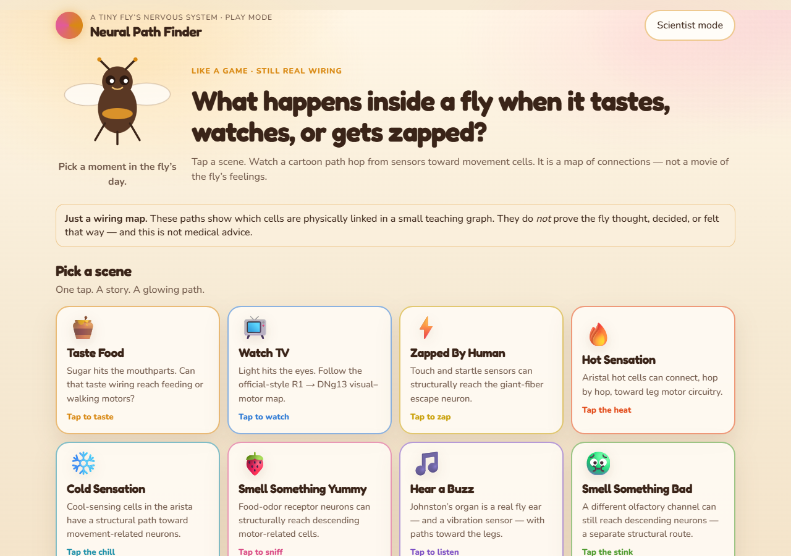
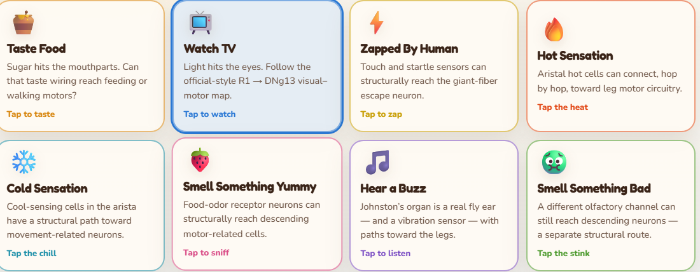
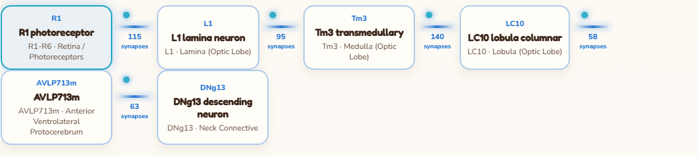
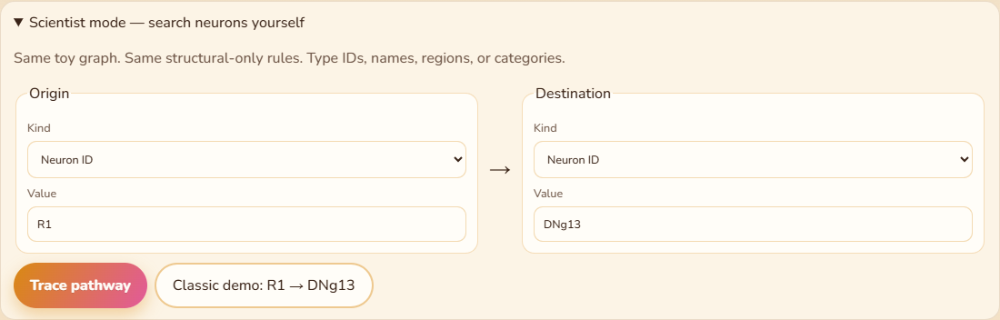

# Screenshots

Walkthrough captures of Neural Path Finder (daylight theme). These files are part of the git tree so GitHub can render them in the [README](../../README.md) and [User Guide](../USER_GUIDE.md).

| File | What it shows |
| --- | --- |
| [01-home.png](01-home.png) | Landing page, mascot, eight scene cards |
| [02-scenarios.png](02-scenarios.png) | Watch TV card selected |
| [03-connectome-path.png](03-connectome-path.png) | Watch TV path, hop strip, explanations |
| [04-journey-track.png](04-journey-track.png) | Close-up of the neuron hop strip |
| [05-zapped-run.png](05-zapped-run.png) | Zapped By Human result |
| [06-compare-taste-tv.png](06-compare-taste-tv.png) | Taste food vs watch TV comparison |
| [07-scientist-mode.png](07-scientist-mode.png) | Scientist mode origin / destination pickers |

